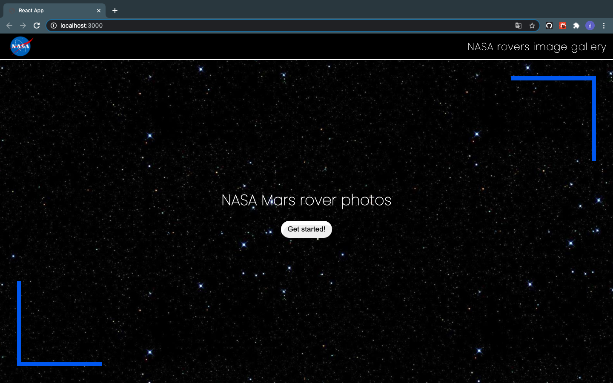
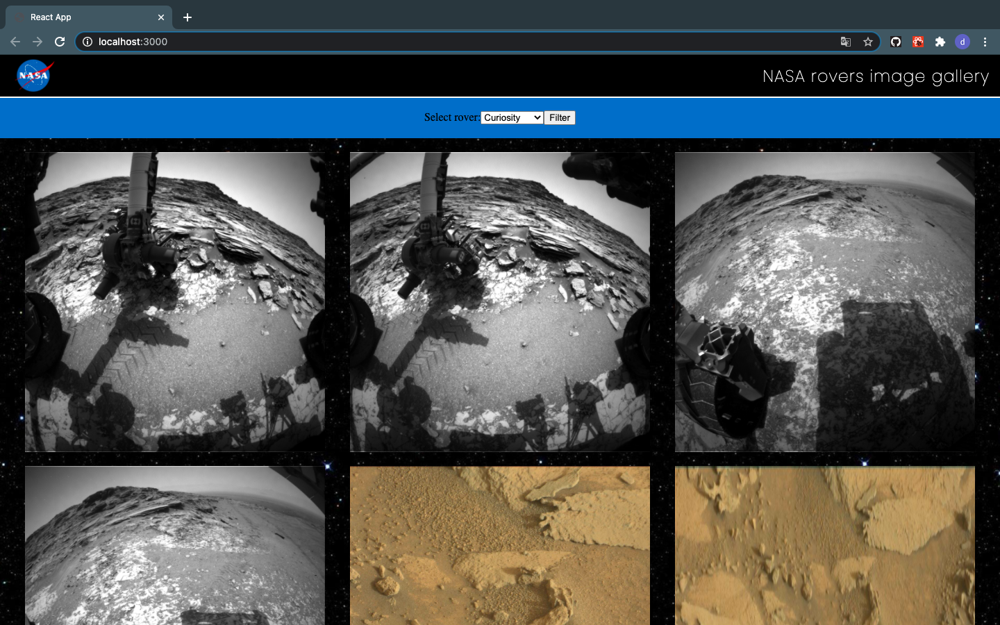

# Nasa rovers image gallery

> This is an application for explore photos taken from Mars rovers.

## Table of contents

- [Screenshots](#screenshots)
- [Technologies](#technologies)
- [Setup](#setup)
- [Features](#features)
- [Status](#status)
- [Contact](#contact)

## Screenshots

## Technologies

- React js - version 17.0.1
- Sass
- Bem 

## Setup

In order to run this app localy clone this repo and run `npm install` to install all the dependencies and `npm start` to start development server.

## Features

-User can choose which rover he wants to view photos from
-More features will be added soon

## Status

Project is: _in progress_

## Contact

Created by Dawid Kutwin.
e-mail: dawid.kutwin200@gmail.com
